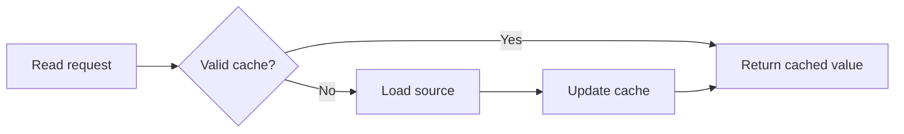

# Example — Explanation Document

This example demonstrates the pattern; it is not a canonical rule source.

# 캐시 무효화가 필요한 이유

캐시는 이전 계산이나 원격 응답을 재사용해 비용과 지연을 줄입니다. 대신 원본 데이터가 바뀌면 캐시가 더 이상 최신 상태를 나타내지 않을 수 있습니다. 캐시 무효화는 이 시점에 오래된 값을 제거하거나 다시 가져오도록 만드는 과정입니다.

## Background

항상 원본을 조회하면 최신성은 높지만 네트워크·계산 비용이 커집니다. 반대로 캐시를 오래 유지하면 응답은 빨라지지만 오래된 데이터를 보여줄 위험이 커집니다.

## How it works

무효화 정책은 “언제 캐시를 더 이상 유효하다고 보지 않을 것인가”를 결정합니다.

## Tradeoffs

- 짧은 유효 기간: 최신성은 높지만 원본 조회가 늘어납니다.
- 긴 유효 기간: 조회 비용은 줄지만 오래된 데이터가 남을 가능성이 커집니다.
- 이벤트 기반 무효화: 최신성과 효율을 함께 얻을 수 있지만 변경 이벤트의 신뢰성과 구현 복잡도를 관리해야 합니다.
